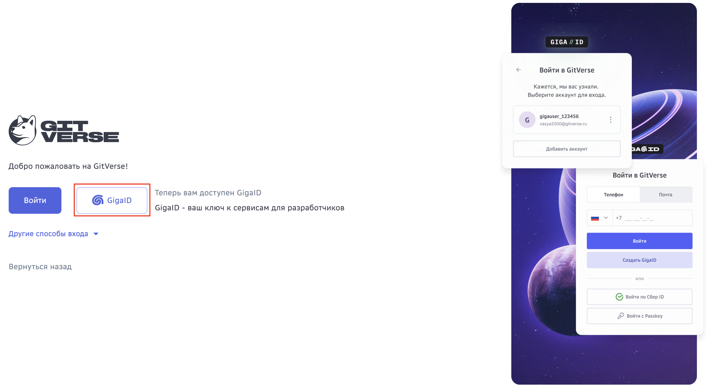
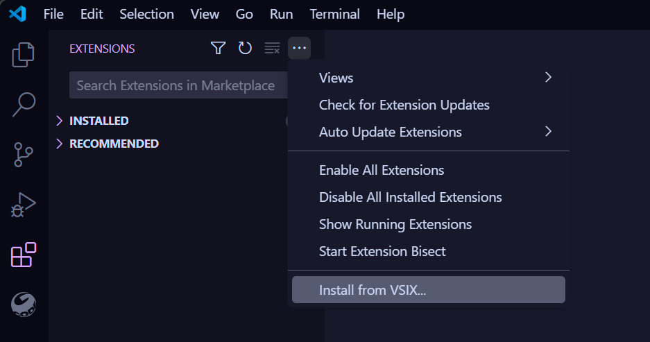
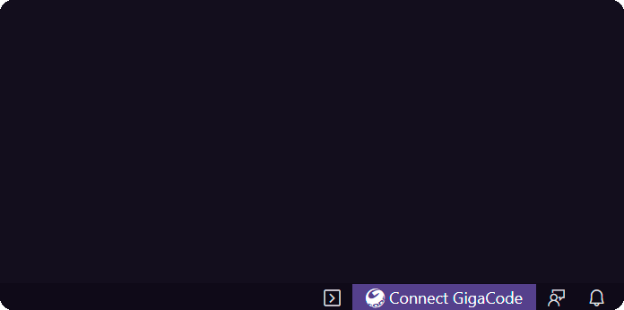
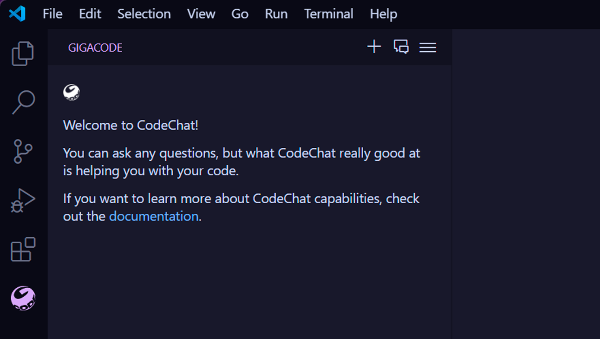
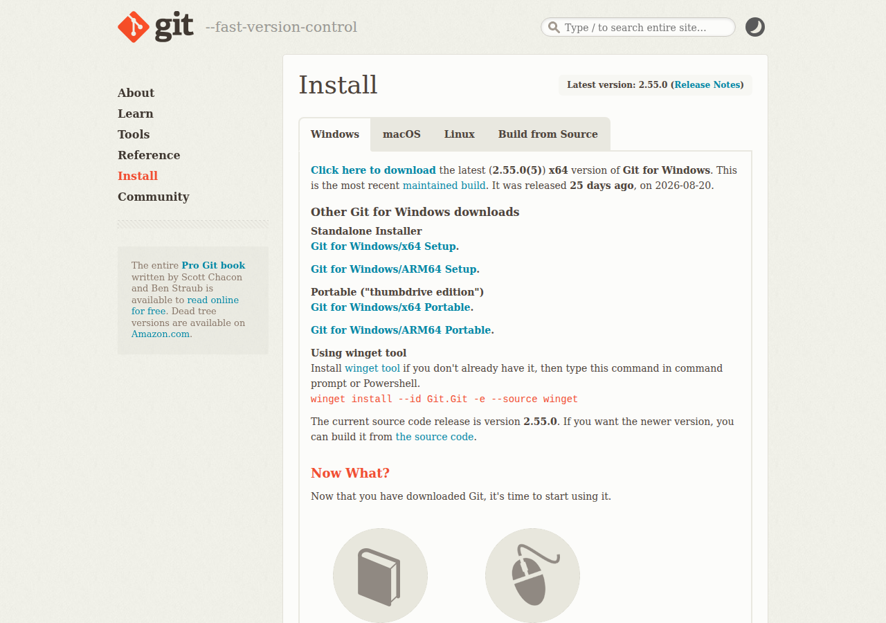
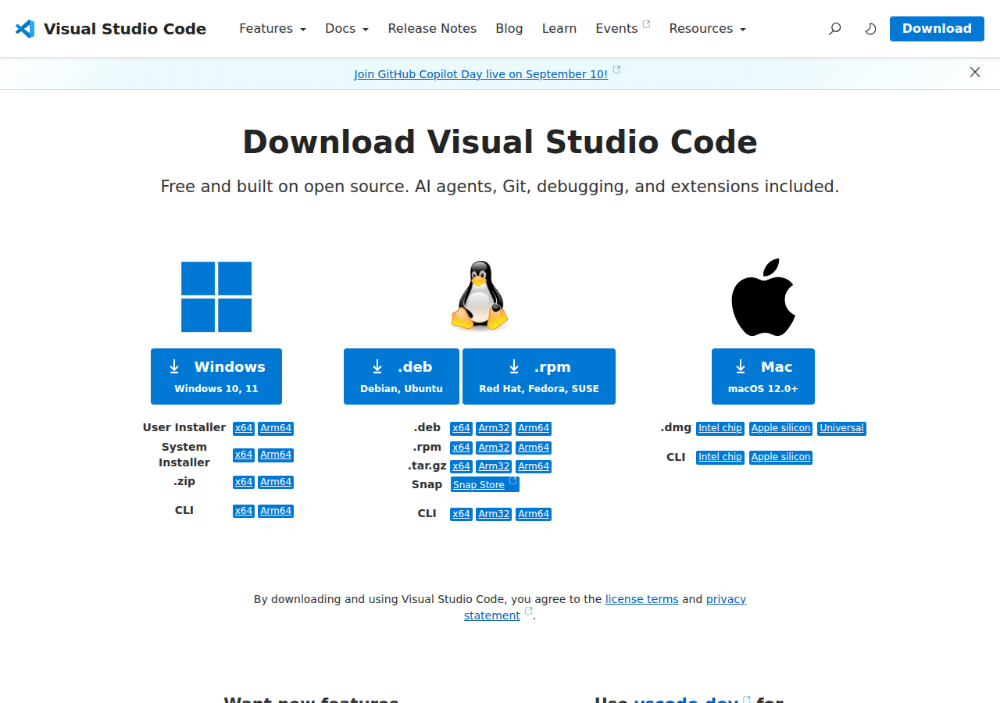
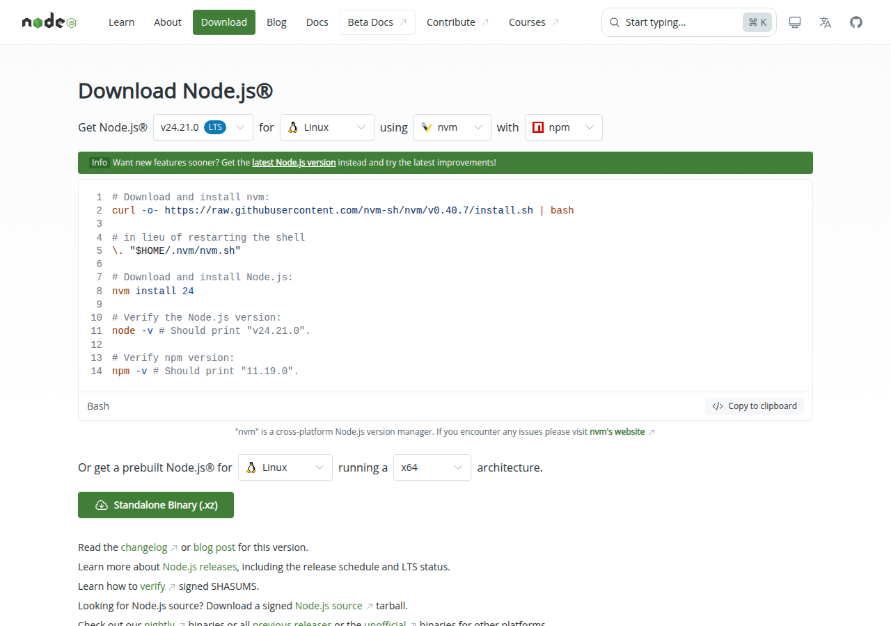
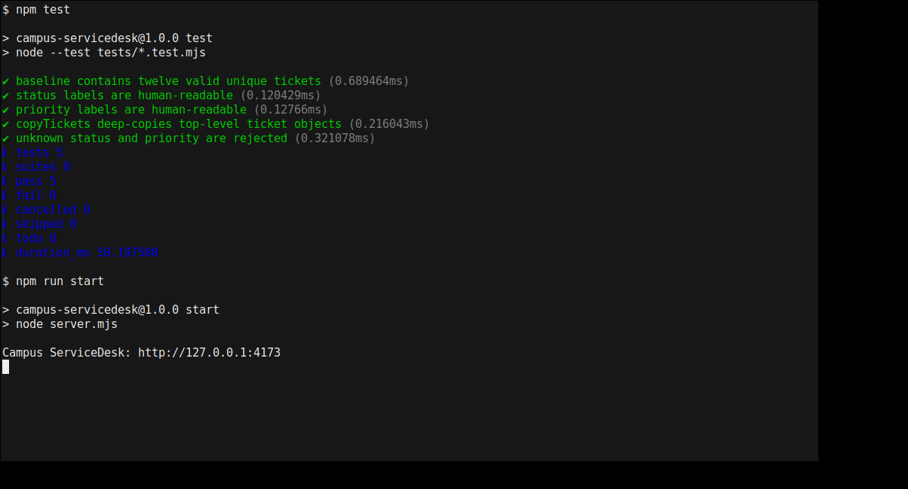
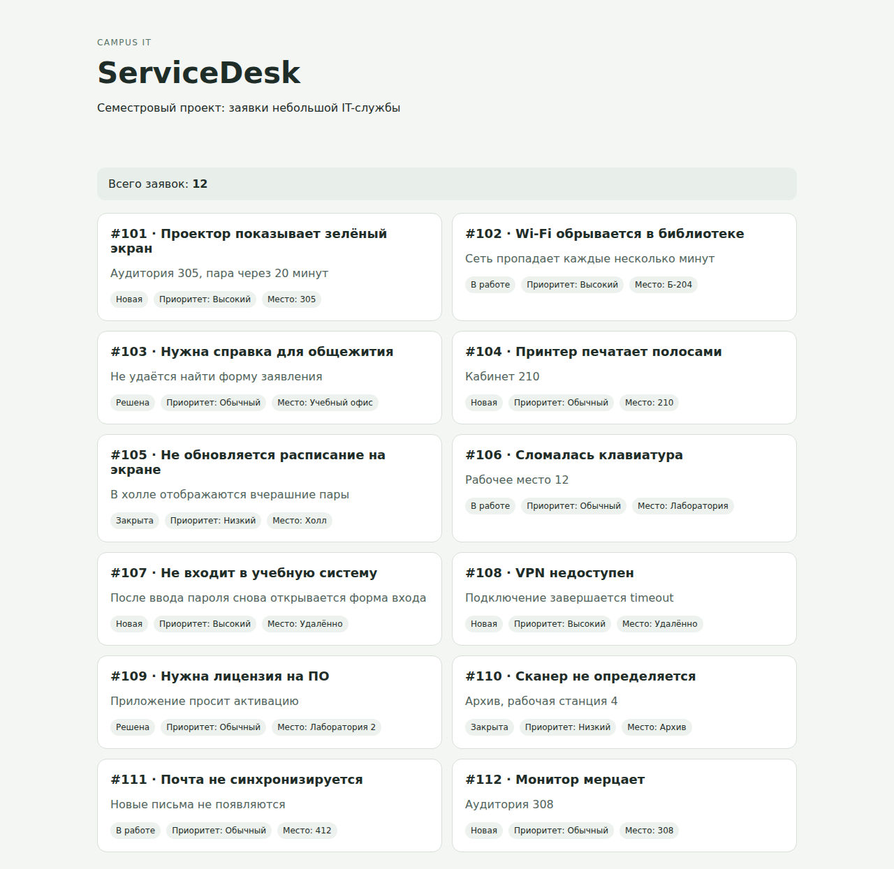

# Настоящие скриншоты занятия 01

Официальные экраны и снимки реально запущенного проекта.

## Часть 1. Выбор способа входа в GitVerse

Официальный снимок экрана. Выберите GigaID, затем войдите или создайте аккаунт. Это не личный кабинет преподавателя.

[Официальный источник](https://gitverse.ru/docs/gitverse/account-profile/quick-start)

## Часть 5. Установка GigaCode из файла

Откройте Extensions (Расширения), нажмите многоточие и выберите Install from VSIX… (Установить из VSIX). Укажите скачанный файл расширения.

[Официальный источник](https://gitverse.ru/features/gigacode/install/)

## Часть 5. Подключение GigaCode

Нажмите Connect GigaCode (Подключить GigaCode). Подтвердите вход в браузере и вернитесь в редактор.

[Официальный источник](https://gitverse.ru/features/gigacode/install/)

## Часть 5. Панель GigaCode после установки

Официальный скриншот открытого чата. Отправьте свой запрос и проверьте ответ: одна только открытая панель не доказывает работоспособность.

[Официальный источник](https://gitverse.ru/features/gigacode/install/)

## Часть 2. Откуда скачать Git

Настоящая страница загрузки Git. На обычном Windows-компьютере выберите x64 Setup. Номер версии со временем меняется.

[Официальный источник](https://git-scm.com/install/windows)

## Часть 3. Какой Visual Studio Code скачать

В колонке Windows выберите User Installer x64. Это VS Code, а не Visual Studio.

[Официальный источник](https://code.visualstudio.com/Download?_exp_download=fb315fc982)

## Часть 4. Где выбрать Node.js

Здесь сайт автоматически выбрал Linux. На Windows выберите Windows, x64, ветку 22 LTS и установщик .msi. Команды установки для Linux копировать не нужно.

[Официальный источник](https://nodejs.org/en/download)

## Часть 9. Настоящий запуск тестов и сервера

Реальный терминал Linux с выполненными командами. В Windows оформление другое. Проверяйте 5 пройденных тестов и адрес 127.0.0.1:4173.

## Часть 9. Исходный Campus ServiceDesk

Настоящий запуск проекта из архива первого занятия: 12 заявок. Поиск, база и создание заявок на этом этапе ещё не реализованы.

